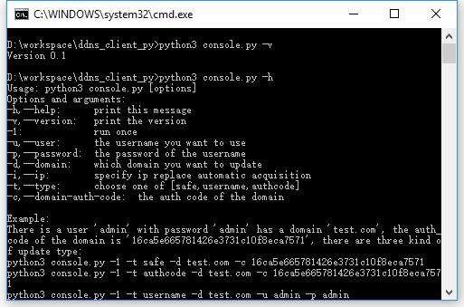

#Ownnet DDNS 客户端

##简介
  
Ownnet DDNS客户端，使用python3编写

##安装与使用
####安装python3
安装[python3](https://www.python.org/downloads/)
####安装依赖
需要安装第三方库：requests  (好像已经内置了？)  
PIP方式：`pip3 install requests`  
或  
Debian下使用：`apt-get install python3-requests`
####下载本仓库
通过git方式或者http方式下载并解压
####使用方法
（假设您的用户名admin，密码admin，有一个域名test.com，其auth code为16ca5e665781426e3731c10f8eca7571，有三种方法可以使用  
1. 默认的safe模式  
`python3 console.py -1 -t safe -d test.com -c 16ca5e665781426e3731c10f8eca7571`  
2. 用户名密码模式  
`python3 console.py -1 -t username -d test.com -u admin -p admin`  
3. 域名授权码模式  
`python3 console.py -1 -t authcode -d test.com -c 16ca5e665781426e3731c10f8eca7571`

三种模式的区别见设计文档ownnet/ddns仓库中相关说明

##TODO
多域名支持  
GUI版本